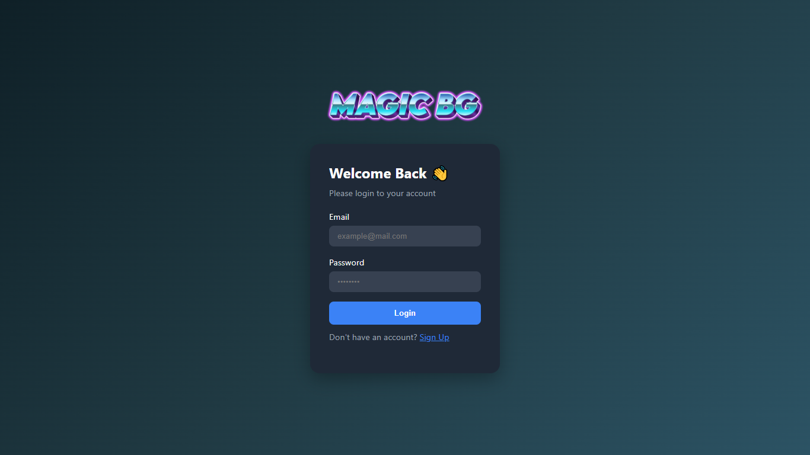
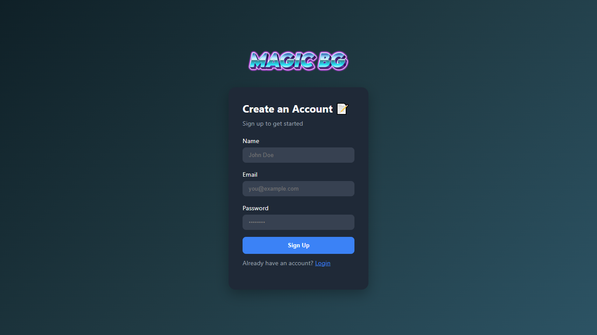

#  PHP Login & Signup Form

 

A clean, responsive login and signup form built using **PHP**, **HTML**, and **CSS**. The project features a simple yet functional authentication system with password hashing, stored in a `users.json` file. It includes error/success messaging and is designed to be easily customizable with a modular structure.

🔐 **Features:**
- Login & Signup functionality
- Secure password hashing
- User data stored in `users.json` (no DB required)
- Responsive and modern design
- Modular components for easy maintenance
- Beginner-friendly structure and easy to extend

---

## 📋 Table of Contents

- [Features](#-features)
- [Screenshots](#-screenshots)
---

## 🌟 Features

- **Modular Design**: Reusable PHP components for input fields, buttons, and form cards.
- **Simple UI**: Clean and modern look with responsive CSS styling.
- **Password Security**: Secure password storage using PHP's `password_hash` function.
- **JSON File Storage**: User data stored in a simple `users.json` file (no database required).
- **Error and Success Messaging**: Inform users with clear messages upon login/signup actions.
- **Fully Functional**: Both login and sign-up systems work out of the box.
- **Responsive Design**: Works seamlessly across devices.

---

## 📸 Screenshots

_Example of the Login page UI_

_Example of the Signup page UI_

---

